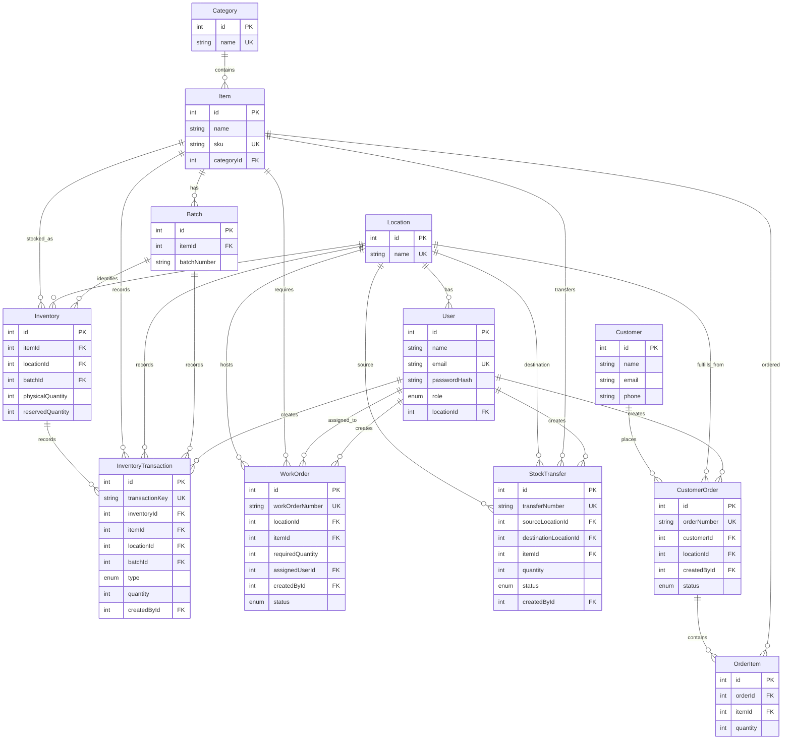

# Entity Relationship Diagram

The following Mermaid diagram represents the current Prisma relational model.

```mermaid
erDiagram
    User {
        int id PK
        string name
        string email UK
        string passwordHash
        enum role
        int locationId FK
    }

    Location {
        int id PK
        string name UK
    }

    Category {
        int id PK
        string name UK
    }

    Item {
        int id PK
        string name
        string sku UK
        int categoryId FK
    }

    Batch {
        int id PK
        int itemId FK
        string batchNumber
    }

    Inventory {
        int id PK
        int itemId FK
        int locationId FK
        int batchId FK
        int physicalQuantity
        int reservedQuantity
    }

    InventoryTransaction {
        int id PK
        string transactionKey UK
        int inventoryId FK
        int itemId FK
        int locationId FK
        int batchId FK
        enum type
        int quantity
        int createdById FK
    }

    WorkOrder {
        int id PK
        string workOrderNumber UK
        int locationId FK
        int itemId FK
        int requiredQuantity
        int assignedUserId FK
        int createdById FK
        enum status
    }

    StockTransfer {
        int id PK
        string transferNumber UK
        int sourceLocationId FK
        int destinationLocationId FK
        int itemId FK
        int quantity
        enum status
        int createdById FK
    }

    Customer {
        int id PK
        string name
        string email
        string phone
    }

    CustomerOrder {
        int id PK
        string orderNumber UK
        int customerId FK
        int locationId FK
        int createdById FK
        enum status
    }

    OrderItem {
        int id PK
        int orderId FK
        int itemId FK
        int quantity
    }

    Location ||--o{ User : has
    Category ||--o{ Item : contains
    Item ||--o{ Batch : has
    Item ||--o{ Inventory : stocked_as
    Location ||--o{ Inventory : stores
    Batch ||--o{ Inventory : identifies

    Inventory ||--o{ InventoryTransaction : records
    Item ||--o{ InventoryTransaction : records
    Location ||--o{ InventoryTransaction : records
    Batch ||--o{ InventoryTransaction : records
    User ||--o{ InventoryTransaction : creates

    Location ||--o{ WorkOrder : hosts
    Item ||--o{ WorkOrder : requires
    User ||--o{ WorkOrder : assigned_to
    User ||--o{ WorkOrder : creates

    Location ||--o{ StockTransfer : source
    Location ||--o{ StockTransfer : destination
    Item ||--o{ StockTransfer : transfers
    User ||--o{ StockTransfer : creates

    Customer ||--o{ CustomerOrder : places
    Location ||--o{ CustomerOrder : fulfills_from
    User ||--o{ CustomerOrder : creates
    CustomerOrder ||--o{ OrderItem : contains
    Item ||--o{ OrderItem : ordered
```
